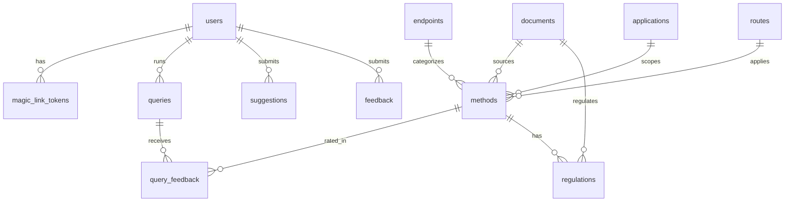

# Database tables

**PostgreSQL only** (not SQLite). Schema for 3R Assist; source of truth: `backend/app/db/migrations/`.

Engine: PostgreSQL via Neon (Vercel Postgres) or a local PostgreSQL instance. Driver: `asyncpg`. Connection: `DATABASE_URL` (`postgresql://` / `postgres://`). See ADR-013 in `docs/decisions.md`.

| Table | Purpose |
| --- | --- |
| [methods](#methods) | Curated 3R alternative methods corpus |
| [regulations](#regulations) | Per-method regulatory recognition by jurisdiction |
| [endpoints](#endpoints) | Controlled vocabulary for toxicological endpoints |
| [routes](#routes) | Controlled vocabulary for administration routes |
| [applications](#applications) | Controlled vocabulary for intended use / purpose |
| [users](#users) | Authenticated users (email magic link) |
| [magic_link_tokens](#magic_link_tokens) | Single-use magic-link tokens |
| [queries](#queries) | Protocol analysis / search sessions |
| [query_feedback](#query_feedback) | User ratings of recommended methods |
| [feedback](#feedback) | General user feedback (page URL, subject, message) |
| [suggestions](#suggestions) | User-submitted method suggestions for curation |
| [documents](#documents) | Catalogue of source documents (protocols, guidelines, regulations) |
| [schema_migrations](#schema_migrations) | Applied migration filenames |

---

## methods

Curated catalogue of alternative methods (replacement, reduction, refinement). Only rows with `active = TRUE` are eligible for retrieval. Scientific `validation_status` lives on this table; jurisdiction / regulatory recognition live in `regulations`.

| Column | Type | Nullable | Default | Description |
| --- | --- | --- | --- | --- |
| `id` | `SERIAL` | NO | auto | Primary key. |
| `slug` | `TEXT` | NO | — | Unique URL-safe identifier (e.g. `oecd-tg439-epiderm`). |
| `active` | `BOOLEAN` | NO | `FALSE` | Whether the method is live in retrieval. Starts `FALSE` pending expert review. |
| `name` | `JSONB` | NO | — | Localized method name: `{"en-us": "...", "pt-br": "..."}`. |
| `description` | `JSONB` | NO | — | Localized full description: `{"en-us": "...", "pt-br": "..."}`. |
| `animal_use` | `TEXT` | YES | — | How the method uses animals or animal materials: `none`, `animal_derived_material`, `slaughterhouse_byproduct`, `animals_killed_for_tissue`, `live_animals`, `mixed_or_variable`. |
| `test_system` | `JSONB` | YES | — | Test system kinds (multi-select array): `in_silico`, `in_chemico`, `in_vitro`, `ex_vivo`, `in_vivo`, `hybrid`, `unclear`. |
| `endpoints` | `INTEGER[]` | NO | — | Ordered vector of endpoint ids (`endpoints.id`). API also exposes `endpoint_codes` from `endpoints.slug`. |
| `routes_applicable` | `INTEGER[]` | YES | — | Applicable route ids (`routes.id`). `NULL` means route-agnostic. API also exposes `route_codes` / `route_names`. |
| `application_ids` | `INTEGER[]` | NO | — | Ordered vector of application ids (`applications.id`). API also exposes `application_codes` / `application_names`. |
| `oecd_ref` | `TEXT` | YES | — | OECD Test Guideline or Guidance Document reference (e.g. `TG 439`, `GD 129`). `NULL` for non-OECD methods. |
| `ncit_id` | `TEXT` | YES | — | NCI Thesaurus concept ID for the endpoint category. |
| `source_citation` | `TEXT` | YES | — | Bibliographic citation for the primary source document. API responses fall back to `documents.doc_citation` (`en-us`, then `pt-br`) when null. |
| `source_doc_id` | `INTEGER` | YES | — | FK → `documents(id)` `ON DELETE SET NULL`. Primary source document. API exposes `source_url` from `documents.url`. |
| `source_db` | `TEXT` | NO | — | Provenance of the curated entry. Values: `OECD_TG`, `ECVAM_DBALM`, `NICEATM`, `FARMACOPEIA_BR`, `TSAR`. |
| `validation_status` | `TEXT` | NO | `not_evaluated` | Scientific validation standing: `not_evaluated`, `under_validation`, `validated`, `partially_validated`, `not_validated`, `unclear`. |
| `validation_doc_id` | `INTEGER` | YES | — | FK → `documents(id)` `ON DELETE SET NULL`. Primary document evidencing validation status. API exposes `validation_url` from `documents.url`. |
| `replacement_rationale` | `JSONB` | YES | — | Localized replacement rationale `{"en-us":"...","pt-br":"..."}`. Non-null with non-empty locale text ⇒ qualifies as replacement (ADR-023). |
| `reduction_rationale` | `JSONB` | YES | — | Localized reduction rationale. Non-null with non-empty locale text ⇒ qualifies as reduction. |
| `refinement_rationale` | `JSONB` | YES | — | Localized refinement rationale. Non-null with non-empty locale text ⇒ qualifies as refinement. |
| `keywords` | `JSONB` | NO | `{"en-us":[],"pt-br":[]}` | Localized synonym / search terms: `{"en-us": [...], "pt-br": [...]}`. |
| `text_for_embedding` | `TEXT` | NO | — | English-only string used at embed time; must match the string that produced `embedding_json`. |
| `embedding_json` | `JSONB` | YES | — | 384-dim float embedding vector. `NULL` until `embed_methods.py` runs. |
| `created_at` | `TIMESTAMPTZ` | NO | `NOW()` | Row creation time. |
| `updated_at` | `TIMESTAMPTZ` | NO | `NOW()` | Last update time. |

**Indexes:** GIN on `endpoints`, GIN on `routes_applicable`, GIN on `application_ids`, `active`, `source_doc_id`, `validation_doc_id`, GIN on `test_system`.

**3R qualification:** presence of a non-null `*_rationale` object with non-empty text in either locale means the method qualifies for that R. There is no separate companion flag column. Filter semantics: `replacement_rationale IS NOT NULL` (and likewise for reduction/refinement).

---

## regulations

Regulatory recognition for a method, scoped by jurisdiction. One row per `(method_id, jurisdiction)`.

| Column | Type | Nullable | Default | Description |
| --- | --- | --- | --- | --- |
| `id` | `SERIAL` | NO | auto | Primary key. |
| `method_id` | `INTEGER` | NO | — | FK → `methods(id)` `ON DELETE CASCADE`. |
| `jurisdiction` | `JSONB` | NO | — | Localized regulatory jurisdiction: `{"en-us":"...","pt-br":"..."}` — Brazil/Brasil, EU/UE, US/EUA, OECD/OCDE. |
| `regulatory_status` | `TEXT` | YES | — | Regulatory standing: `not_approved`, `approved`, `recommended`, or `mandatory`. |
| `regulatory_date` | `DATE` | YES | — | Date of the regulation / recognition / adoption for this context (`YYYY-MM-DD`). |
| `regulatory_endpoints` | `INTEGER[]` | YES | — | Ordered vector of recognized endpoint ids (`endpoints.id`). API also exposes `regulatory_endpoint_names` from `endpoints.name`. |
| `endpoint_quote` | `TEXT` | YES | — | Supporting quotation for `regulatory_endpoints`. |
| `regulatory_body` | `JSONB` | YES | — | Localized issuing body `{"en-us":"...","pt-br":"..."}` (e.g. OECD/OCDE, CONCEA). |
| `regulatory_doc_id` | `INTEGER` | YES | — | FK → `documents(id)` `ON DELETE SET NULL`. Regulatory document for this context. API exposes `regulatory_url` from `documents.url`. |
| `regulatory_citation` | `JSONB` | YES | — | Localized bibliographic citation `{"en-us":"...","pt-br":"..."}`. API responses fall back to `documents.doc_citation` when empty. |
| `notes` | `TEXT` | YES | — | Free-text notes (applicability limits, pending verification, etc.). |
| `created_at` | `TIMESTAMPTZ` | NO | `NOW()` | Row creation time. |

**Constraints:** `UNIQUE (method_id, jurisdiction)`.

**Indexes:** `method_id`, `jurisdiction`, `regulatory_doc_id`.

---

## endpoints

Controlled vocabulary for toxicological endpoint categories (`parameter_model.md` §3.1). Referenced by `methods.endpoints` and `routes.compatible_endpoints`.

| Column | Type | Nullable | Default | Description |
| --- | --- | --- | --- | --- |
| `slug` | `TEXT` | NO | — | Primary key, hyphenated (e.g. `skin-irritation`, `acute-toxicity`). |
| `id` | `INTEGER` | NO | auto | Unique integer id referenced by `methods.endpoints` and `regulations.regulatory_endpoints`. |
| `parent_id` | `INTEGER` | YES | `NULL` | Self-FK → `endpoints(id)` `ON DELETE SET NULL`. Parent endpoint in a hierarchy. |
| `code` | `TEXT` | YES | `NULL` | Hierarchical code (e.g. `2.1.1.1`). |
| `external_oht_codes` | `JSONB` | YES | — | OECD Harmonised Template codes as a JSON string array (e.g. `["58","66-1"]`). |
| `name` | `JSONB` | NO | — | Localized display name: `{"en-us": "...", "pt-br": "..."}`. |
| `description` | `JSONB` | YES | — | Localized longer description / examples. |
| `sort_order` | `INTEGER` | NO | `0` | Display order in UI lists. |
| `active` | `BOOLEAN` | NO | `TRUE` | Whether the value is selectable. |
| `created_at` | `TIMESTAMPTZ` | NO | `NOW()` | Row creation time. |
| `updated_at` | `TIMESTAMPTZ` | NO | `NOW()` | Last update time (trigger-maintained). |

**Catalogue:** 54 hierarchical endpoints (ids 1–54) covering toxicokinetics, human-health effects, mechanistic activities, ecotoxicology, product-safety contaminants, and diagnostic targets.

---

## routes

Controlled vocabulary for chemical administration routes (`parameter_model.md` §3.2).

| Column | Type | Nullable | Default | Description |
| --- | --- | --- | --- | --- |
| `slug` | `TEXT` | NO | — | Primary key (e.g. `oral`, `cutaneous`). |
| `id` | `INTEGER` | NO | auto | Unique integer id. |
| `name` | `JSONB` | NO | — | Localized display name: `{"en-us": "...", "pt-br": "..."}`. |
| `description` | `JSONB` | YES | — | Localized longer description / synonyms. |
| `compatible_endpoints` | `INTEGER[]` | YES | — | Endpoint ids (`endpoints.id`) compatible with this route. |
| `sort_order` | `INTEGER` | NO | `0` | Display order in UI lists. |
| `active` | `BOOLEAN` | NO | `TRUE` | Whether the value is selectable. |
| `created_at` | `TIMESTAMPTZ` | NO | `NOW()` | Row creation time. |
| `updated_at` | `TIMESTAMPTZ` | NO | `NOW()` | Last update time (trigger-maintained). |

**Seeded slugs:** `cutaneous`, `inhalation`, `oral`, `ocular`, `intranasal`, `intratracheal`, `intravenous`, `intra-arterial`, `intramuscular`, `subcutaneous`, `intradermal`, `intraperitoneal`, `rectal`, `vaginal`, `topical-mucosal`, `implantation`, `multiple`, `not-applicable`, `unspecified`, `other`.

---

## applications

Controlled vocabulary for the intended use of a method or study. Referenced by `methods.application_ids`.

| Column | Type | Nullable | Default | Description |
| --- | --- | --- | --- | --- |
| `slug` | `TEXT` | NO | — | Primary key (e.g. `basic-research`, `regulatory-use`). |
| `id` | `INTEGER` | NO | auto | Unique integer id. |
| `name` | `JSONB` | NO | — | Localized display name: `{"en-us": "...", "pt-br": "..."}`. |
| `description` | `JSONB` | YES | — | Localized longer description. |
| `sort_order` | `INTEGER` | NO | `0` | Display order in UI lists. |
| `active` | `BOOLEAN` | NO | `TRUE` | Whether the value is selectable. |
| `created_at` | `TIMESTAMPTZ` | NO | `NOW()` | Row creation time. |
| `updated_at` | `TIMESTAMPTZ` | NO | `NOW()` | Last update time (trigger-maintained). |

**Seeded slugs:** `basic-research`, `translational-applied-research`, `regulatory-use`, `routine-production`, `education-training`, `environmental-protection`, `species-preservation`, `forensic-inquiry`, `other`.

---

## users

Registered users authenticated via email magic link (F08).

| Column | Type | Nullable | Default | Description |
| --- | --- | --- | --- | --- |
| `id` | `SERIAL` | NO | auto | Primary key. |
| `email` | `TEXT` | NO | — | Unique email address. |
| `created_at` | `TIMESTAMPTZ` | NO | `NOW()` | Account creation time. |
| `last_seen_at` | `TIMESTAMPTZ` | NO | `NOW()` | Last successful magic-link validation (set by auth flow). |

---

## magic_link_tokens

Single-use login tokens. Tokens are signed with `itsdangerous`; this table tracks usage to prevent replay within the validity window. The raw token is never stored.

| Column | Type | Nullable | Default | Description |
| --- | --- | --- | --- | --- |
| `id` | `SERIAL` | NO | auto | Primary key. |
| `user_id` | `INTEGER` | NO | — | FK → `users(id)` `ON DELETE CASCADE`. |
| `token_hash` | `TEXT` | NO | — | SHA-256 hash of the raw token. Unique. |
| `expires_at` | `TIMESTAMPTZ` | NO | — | Token expiry time. |
| `used_at` | `TIMESTAMPTZ` | YES | — | Set on first successful verify. `NULL` means unused. |
| `created_at` | `TIMESTAMPTZ` | NO | `NOW()` | Token issuance time. |

**Indexes:** `token_hash`; partial index on `expires_at` where `used_at IS NULL`.

---

## queries

One row per protocol analysis or search session (F09). Stores extraction output and a snapshot of recommendations so history stays stable if methods change later.

| Column | Type | Nullable | Default | Description |
| --- | --- | --- | --- | --- |
| `id` | `SERIAL` | NO | auto | Primary key. |
| `user_id` | `INTEGER` | YES | — | FK → `users(id)` `ON DELETE SET NULL`. `NULL` = anonymous session. |
| `protocol_text` | `TEXT` | NO | — | Raw protocol input text (stored with user consent). |
| `extracted_params` | `JSONB` | YES | — | Extraction result per `parameter_model.md`: `{ endpoint_category, route, application, procedure_text, species, n_animals, regulatory, … }`. |
| `confidence` | `TEXT` | YES | — | Overall extraction confidence: `high`, `medium`, or `low`. |
| `results_snapshot` | `JSONB` | YES | — | Recommendations at query time: `[{ method_id, slug, score }, ...]`. |
| `created_at` | `TIMESTAMPTZ` | NO | `NOW()` | Query time. |

**Indexes:** `user_id`, `created_at DESC`.

---

## query_feedback

Structured relevance feedback for a recommended method within a query (F11). One rating per method per query.

| Column | Type | Nullable | Default | Description |
| --- | --- | --- | --- | --- |
| `id` | `SERIAL` | NO | auto | Primary key. |
| `query_id` | `INTEGER` | NO | — | FK → `queries(id)` `ON DELETE CASCADE`. |
| `method_id` | `INTEGER` | NO | — | FK → `methods(id)` `ON DELETE CASCADE`. |
| `rating` | `TEXT` | NO | — | Relevance rating: `relevant`, `partial`, or `not_relevant`. |
| `comment` | `TEXT` | YES | — | Optional free-text comment. |
| `created_at` | `TIMESTAMPTZ` | NO | `NOW()` | Feedback submission time. |

**Constraints:** `UNIQUE (query_id, method_id)`.

**Indexes:** `query_id`, `method_id`, `rating`.

---

## feedback

General user feedback about a page or product surface (distinct from [query_feedback](#query_feedback) recommendation ratings).

| Column | Type | Nullable | Default | Description |
| --- | --- | --- | --- | --- |
| `id` | `SERIAL` | NO | auto | Primary key. |
| `user_id` | `INTEGER` | YES | — | FK → `users(id)` `ON DELETE SET NULL`. Submitter, if authenticated. |
| `url` | `TEXT` | NO | — | Page or resource URL where the feedback was submitted. |
| `object` | `TEXT` | NO | — | Subject of the feedback (e.g. UI element, feature, or entity). |
| `feedback_text` | `TEXT` | NO | — | Free-text feedback message. |
| `created_at` | `TIMESTAMPTZ` | NO | `NOW()` | Submission time. |

**Indexes:** `user_id`, `created_at DESC`.

---

## suggestions

User-submitted method suggestions queued for manual curation (F12).

| Column | Type | Nullable | Default | Description |
| --- | --- | --- | --- | --- |
| `id` | `SERIAL` | NO | auto | Primary key. |
| `user_id` | `INTEGER` | YES | — | FK → `users(id)` `ON DELETE SET NULL`. Submitter, if authenticated. |
| `name` | `JSONB` | NO | — | Localized suggested method name: `{"en-us": "...", "pt-br": "..."}`. |
| `description` | `TEXT` | YES | — | Free-text description of the method. |
| `source_url` | `TEXT` | YES | — | Link to a source document or publication. |
| `endpoint_hint` | `TEXT` | YES | — | User's best-guess endpoint category; not validated until review. |
| `status` | `TEXT` | NO | `'pending'` | Curation status: `pending`, `reviewed`, `accepted`, or `rejected`. |
| `reviewer_notes` | `TEXT` | YES | — | Notes from the curator. |
| `submitted_at` | `TIMESTAMPTZ` | NO | `NOW()` | Submission time. |
| `reviewed_at` | `TIMESTAMPTZ` | YES | — | Time of review decision. |

**Indexes:** partial index on `status` where `status = 'pending'`.

---

## documents

Catalogue of source documents used for method curation and regulatory context (protocols, guidelines, regulations).

| Column | Type | Nullable | Default | Description |
| --- | --- | --- | --- | --- |
| `id` | `SERIAL` | NO | auto | Primary key. |
| `slug` | `TEXT` | NO | — | Unique URL-safe identifier (e.g. `oecd-tg439`, `concea-rn-18-2014`). |
| `doc_citation` | `JSONB` | NO | — | Localized document citation / reference key: `{"en-us": "...", "pt-br": "..."}` (e.g. `OECD TG 439`, `RN 18/2014`). |
| `description` | `JSONB` | NO | `{"en-us":"","pt-br":""}` | Localized document description: `{"en-us": "...", "pt-br": "..."}`. |
| `date` | `DATE` | YES | — | Publication / adoption / issuance date. |
| `categories` | `JSONB` | NO | — | Document kinds (multi-select array): `method_protocol`, `guideline`, `regulation`, and/or `other`. |
| `institution` | `JSONB` | YES | — | Localized issuing / responsible institution: `{"en-us": "...", "pt-br": "..."}`. |
| `url` | `TEXT` | YES | — | URL of the document, when available. |

**Constraints:** `UNIQUE (slug)`; `categories` must be a non-empty JSON array whose elements are in (`method_protocol`, `guideline`, `regulation`, `other`).

**Indexes:** GIN on `categories`, btree on `date`.

---

## schema_migrations

Internal bookkeeping for applied SQL migration files. Created by `backend/app/db/connection.py` (`apply_migrations`), not by a numbered migration script.

| Column | Type | Nullable | Default | Description |
| --- | --- | --- | --- | --- |
| `filename` | `TEXT` | NO | — | Primary key. Migration filename (e.g. `001_initial.sql`). |
| `applied_at` | `TIMESTAMPTZ` | NO | `NOW()` | When the migration was applied. |

---

## Entity relationship overview

Migrations that define or alter these tables:

| Migration | Tables |
| --- | --- |
| `001_initial.sql` | `methods`, `method_regulatory_contexts`, `method_keywords` (keywords later folded into `methods`) |
| `002_app_tables.sql` | `users`, `magic_link_tokens`, `queries`, `feedback`, `suggestions` |
| `003_vocabulary_tables.sql` | `endpoints`, `routes`, `study_domains`, `route_endpoints` |
| `004_rename_study_domain.sql` | renames legacy `application_area` / `application_areas` |
| `005_method_validation_contexts.sql` | upgrades legacy schemas to ADR-021/022 |
| `006_route_other.sql` | seeds `routes.other` |
| `007_add_3r_rationale_columns.sql` | adds `replacement_rationale`, `reduction_rationale`, `refinement_rationale` (ADR-023 step 1) |
| `009_add_mvc_purpose.sql` | adds `purpose` to `method_regulatory_contexts` (before `regulatory_body`) |
| `010_add_mvc_regulatory_status.sql` | adds `regulatory_status` to `method_regulatory_contexts` (`not_approved` \| `approved` \| `recommended` \| `mandatory`) |
| `011_mvc_purpose_status_comments.sql` | column comments for `purpose` and `regulatory_status` |
| `012_mvc_regulation_date.sql` | replaces `regulatory_ref` with `regulation_date` on `method_regulatory_contexts` |
| `013_mvc_rename_regulation_fields.sql` | renames `purpose`→`regulation_purpose`, `regulatory_status`→`regulation_status`; reorders to `regulation_status`, `regulation_date`, `regulation_purpose`, `regulatory_body` |
| `014_rename_method_regulatory_contexts.sql` | renames table `method_validation_contexts` → `method_regulatory_contexts` |
| `015_reorder_methods_columns.sql` | reorders `methods`: `active` after `slug`; `embedding_json`, `created_at`, `updated_at` after `refinement_rationale` |
| `016_methods_oecd_ref_reorder.sql` | renames `oecd_tg_ref`→`oecd_ref`; reorders to `endpoint_category`, `routes_applicable`, `study_domain`, `oecd_ref`, `ncit_id`, `source_db` |
| `017_methods_keywords_columns.sql` | moves `text_for_embedding` next to `embedding_json`; adds `keywords_en` / `keywords_pt`; migrates and drops `method_keywords` |
| `018_methods_embed_keywords_reorder.sql` | moves `text_for_embedding`, `keywords_en`, `keywords_pt`, `embedding_json` after `source_db` |
| `019_methods_text_for_embedding_reorder.sql` | moves `text_for_embedding` immediately left of `embedding_json` |
| `020_methods_3r_columns_reorder.sql` | moves `category_3r` (if present) and `*_rationale` after `source_db` |
| `021_mvc_study_domain_fk.sql` | adds FK `method_regulatory_contexts.study_domain` → `study_domains(code)` |
| `022_methods_source_citation_fields.sql` | adds `source_citation`, `source_url`, `source_date` after `ncit_id` |
| `023_localized_json_fields.sql` | folds `*_en`/`*_pt` into localized JSONB (`name`, `description`, `keywords`) on methods, vocab tables, and suggestions |
| `024_vocab_timestamps_after_description.sql` | reorders `endpoints`/`routes`/`study_domains` so `created_at`/`updated_at` follow `description` |
| `025_drop_mrc_study_domain.sql` | drops `study_domain` from `method_regulatory_contexts`; unique key becomes `(method_id, jurisdiction)` |
| `026_methods_drop_category_3r_reorder.sql` | drops `category_3r`; restores `name`/`description`/`keywords` then `text_for_embedding`/`embedding_json` order |
| `027_documents.sql` | creates `documents` (`slug`, `doc_ref`, `date`, `category`, `url`) |
| `028_doc_fks_and_citations.sql` | `methods.source_doc_id`; MRC `regulatory_doc_id` + `regulatory_citation` (replaces `regulatory_url`); drops `source_url`/`source_date` |
| `029_mrc_validation_status_values.sql` | normalizes MRC `validation_status` to `validated` \| `in_process_of_validation` \| `not_validated`; maps legacy `accepted`/`emerging` values |
| `030_documents_doc_citation.sql` | renames `documents.doc_ref` → `doc_citation` and converts to localized JSONB (`en-us` / `pt-br`) |
| `031_mrc_jurisdiction_localized.sql` | converts `method_regulatory_contexts.jurisdiction` to localized JSONB |
| `032_rename_regulations.sql` | renames table `method_regulatory_contexts` → `regulations` |
| `033_documents_description.sql` | adds localized `documents.description` |
| `034_documents_category_other.sql` | allows `documents.category = 'other'` |
| `035_documents_categories_institution.sql` | `category` → `categories` JSONB multi-select; adds `institution` JSONB left of `url` |
| `036_endpoints_additional.sql` | seeds additional `endpoints` codes (reproductive, endocrine, photoreactivity, aquatic, toxicokinetics, bacterial endotoxin, rabies) |
| `037_methods_animal_use.sql` | adds nullable `methods.animal_use` with CHECK enum |
| `038_methods_test_system.sql` | adds nullable `methods.test_system` JSONB multi-select |
| `039_routes_drop_in_vitro.sql` | removes `routes.in_vitro` (modality lives in `methods.test_system`) |
| `040_methods_rationales_localized.sql` | converts `*_rationale` TEXT → localized JSONB (`en-us` / `pt-br`) |
| `041_methods_animal_test_system_reorder.sql` | moves `animal_use` / `test_system` left of `endpoint_category` |
| `042_methods_validation_status.sql` | adds `methods.validation_status` + `validation_doc_id`; drops `regulations.validation_status` |
| `043_rename_query_feedback.sql` | renames table `feedback` → `query_feedback` |
| `044_feedback.sql` | creates `feedback` (`user_id`, `url`, `object`, `feedback_text`) |
| `045_regulations_body_citation_localized.sql` | `regulations.regulatory_body` / `regulatory_citation` TEXT → localized JSONB |
| `046_regulations_purpose_localized.sql` | `regulations.regulation_purpose` TEXT → localized JSONB |
| `047_regulations_regulatory_prefix.sql` | rename `regulation_*` → `regulatory_*`; backfill status/body/date/citation from documents |
| `048_regulations_regulatory_endpoints.sql` | `regulatory_purpose` → `regulatory_endpoints INTEGER[]`; adds `endpoints.id` |
| `049_endpoint_ids.sql` | `methods.endpoint_category` and `route_endpoints.endpoint_id` → `endpoints.id` |
| `050_methods_endpoint_index.sql` | recreates `idx_methods_endpoint` on `methods.endpoint_category` |
| `051_methods_endpoints_array.sql` | `methods.endpoint_category` INTEGER → `methods.endpoints INTEGER[]` |
| `052_endpoints_code_to_slug.sql` | `endpoints.code` → `slug`; underscores → hyphens |
| `053_endpoints_parent_code.sql` | adds `endpoints.parent_id` and `endpoints.code` |
| `054_replace_endpoints_catalogue.sql` | replaces endpoints catalogue; adds `external_oht_codes` |
| `055_regulations_endpoint_quote.sql` | adds `regulations.endpoint_quote` TEXT |
| `056_regulations_endpoint_quote_backfill.sql` | backfills `regulations.regulatory_endpoints` and `endpoint_quote` |
| `057_methods_endpoints_backfill.sql` | backfills `methods.endpoints` |
| `058_routes_compatible_endpoints.sql` | adds `routes.compatible_endpoints INTEGER[]`; backfills from `route_endpoints` |
| `059_replace_routes_catalogue.sql` | `routes.code` → `slug`; replaces routes catalogue; remaps `dermal` → `cutaneous` |
| `060_drop_route_endpoints.sql` | drops `route_endpoints`; compatibility is `routes.compatible_endpoints` |
| `061_applications_replace_study_domain.sql` | adds `applications`; `methods.study_domain` → `application`; drops `study_domains` |
| `062_routes_applications_id.sql` | adds unique integer `id` on `routes` and `applications` |
| `063_methods_application_route_ids.sql` | `methods.application` → `application_ids`; `routes_applicable` → `INTEGER[]` |
| `manual/008_drop_category_3r.sql` | legacy gated DROP of `category_3r` (superseded by `026`) |
